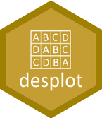

# desplot 

[](https://cran.r-project.org/package=desplot)

Functions for plotting experimental designs of field trials in agriculture.

Key features:

* Flexible options to customize appearance of graphic.

* Stable, well-tested.

## Installation

```R
# Install the released version from CRAN:
install.packages("desplot")

# Install the cutting edge development version from GitHub:
# install.packages("devtools")
devtools::install_github("kwstat/desplot")
```

## Example 1

This data is is from a split-plot experiment with 6 replicates.  The replicates are shown by the colored regions and outlined by the thick lines.  The text codes and the thin lines define the whole-plots.  The nitrogen sub-plot treatments are shown by the text colors.

```R
require(agridat)
require(desplot)
desplot(block ~ col+row, yates.oats,
        col=nitro, text=gen, cex=1, aspect=511/176,
        out1=block, out2=gen, out2.gpar=list(col = "gray50", lwd = 1, lty = 1))
```


## Example 2

Another very useful technique is to color the cells according to a continuous response variable (such as plot yield).

```R
require(agridat)
require(desplot)
desplot(yield ~ col*row, yates.oats,
        col=gen, num=nitro, cex=1, out1=block, aspect=511/176)
```

