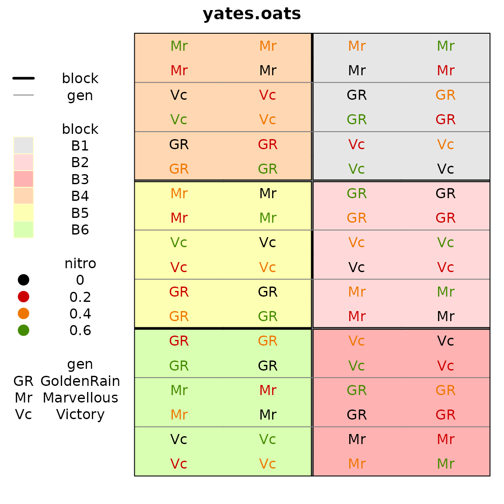
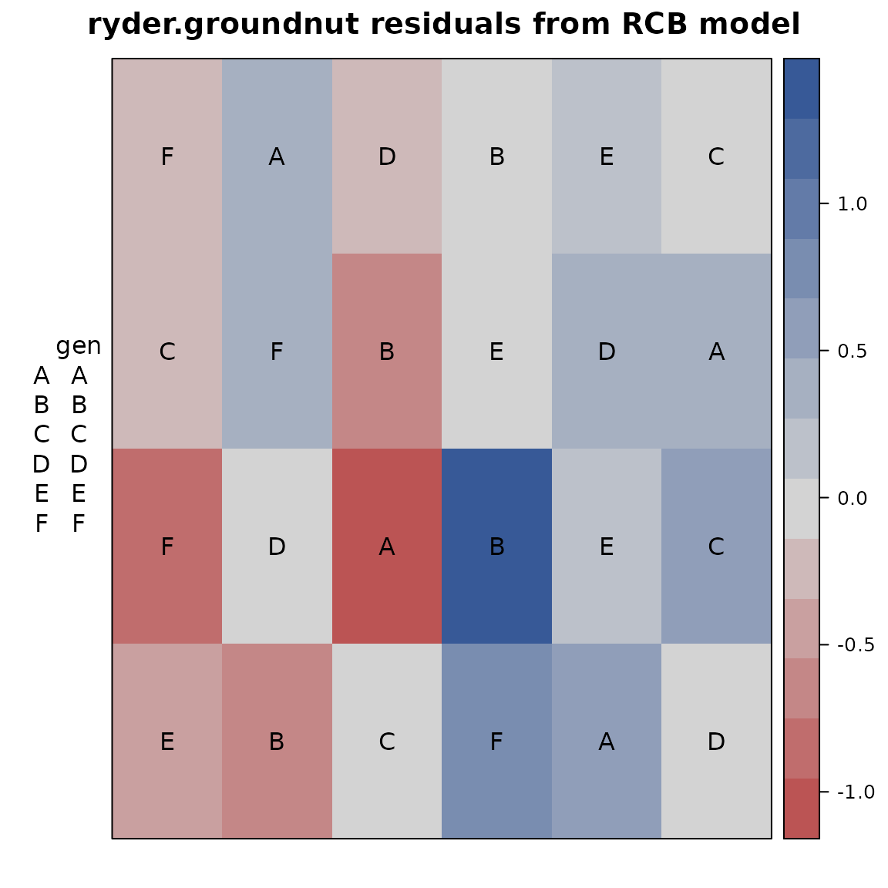

# Plotting field maps with the desplot package

## Abstract

This short note shows how to plot a field map from an agricultural
experiment and why that may be useful.

## R setup

``` r
library("knitr")
knitr::opts_chunk$set(fig.align="center", fig.width=6, fig.height=6)
options(width=90)
```

### Example 1

First, a plot of the experimental design of the oats data from Yates
(1935).

``` r
library(agridat)
library(desplot)
data(yates.oats)
desplot(yates.oats, block ~ col+row,
        col=nitro, text=gen, cex=1, out1=block,
        out2=gen, out2.gpar=list(col = "gray50", lwd = 1, lty = 1))
```



### Example 2

This next example is from Ryder (1981). Fit an ordinary RCB model with
fixed effects for `block` and `genotype`. Plot a heatmap of the
residuals.

``` r
library(agridat)
library(desplot)
data(ryder.groundnut)
gnut <- ryder.groundnut
m1 <- lm(dry ~ block + gen, gnut) # Standard RCB model
gnut$res <- resid(m1)
desplot(gnut, res ~ col + row, text=gen, cex=1,
        main="ryder.groundnut residuals from RCB model")
```

 Note the largest
positive/negative residuals are adjacent to each other, perhaps caused
by the original data values being swapped. Checking with experiment
investigators (managers, data collectors, etc.) is recommended.

## Infrequently asked questions

### How do I change the ordering of panels?

Make sure that the panel variable is a factor and then change the levels
of the factor.

In the example below, the first three panels are set to the levels C1,
C3, C5. The other levels remain in the same (relative) order.

``` r
library(agridat)
library(desplot)
data(besag.met)
desplot(besag.met, yield~col*row|county, main="default county ordering")
library(forcats)
besag.met <- transform(besag.met,
                       county=fct_relevel(county, c("C1","C3","C5")))
desplot(besag.met, yield~col*row|county, main="custom county ordering")
```

### References

Ryder, K. 1981. “Field Plans: Why the Biometrician Finds Them Useful.”
*Experimental Agriculture* 17: 243–56.
<https://doi.org/10.1017/S0014479700011601>.

Yates, Frank. 1935. “Complex Experiments.” *Journal of the Royal
Statistical Society Suppl* 2: 181–247.
<https://doi.org/10.2307/2983638>.
